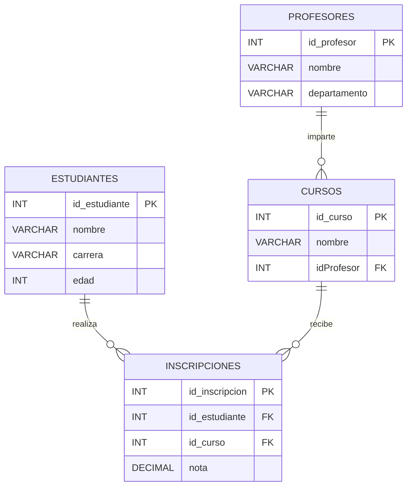

```mermaid
erDiagram
    ESTUDIANTES {
        INT id_estudiante PK
        VARCHAR nombre
        VARCHAR carrera
        INT edad
    }

    PROFESORES {
        INT id_profesor PK
        VARCHAR nombre
        VARCHAR departamento
    }

    CURSOS {
        INT id_curso PK
        VARCHAR nombre
        INT idProfesor FK
    }

    INSCRIPCIONES {
        INT id_inscripcion PK
        INT id_estudiante FK
        INT id_curso FK
        DECIMAL nota
    }

    PROFESORES ||--o{ CURSOS : imparte
    ESTUDIANTES ||--o{ INSCRIPCIONES : realiza
    CURSOS ||--o{ INSCRIPCIONES : recibe

```
