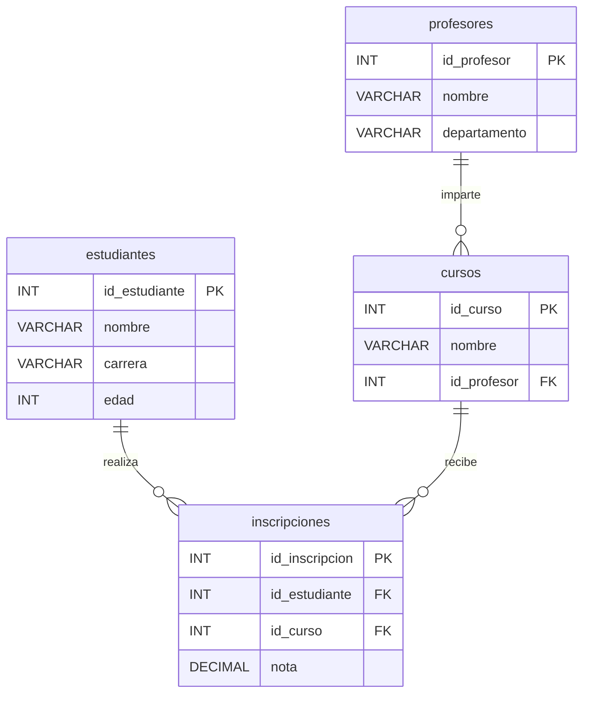

```mermaid
erDiagram
    estudiantes {
        INT id_estudiante PK
        VARCHAR nombre
        VARCHAR carrera
        INT edad
    }

    profesores {
        INT id_profesor PK
        VARCHAR nombre
        VARCHAR departamento
    }

    cursos {
        INT id_curso PK
        VARCHAR nombre
        INT id_profesor FK
    }

    inscripciones {
        INT id_inscripcion PK
        INT id_estudiante FK
        INT id_curso FK
        DECIMAL nota
    }

    profesores ||--o{ cursos : imparte
    estudiantes ||--o{ inscripciones : realiza
    cursos ||--o{ inscripciones : recibe

```
